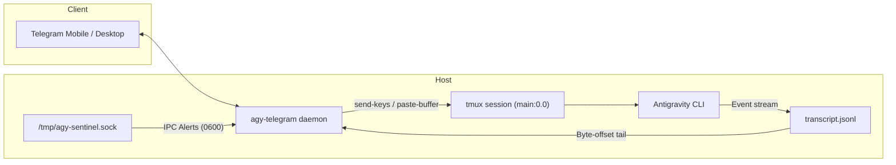

# agy-telegram

[](https://github.com/kappino/agy-telegram/actions/workflows/ci.yml)
[](https://pypi.org/project/agy-telegram/)
[](https://www.python.org/)
[](LICENSE)

A bidirectional Telegram bridge for the Google Antigravity (`agy`) CLI. It connects to an active `tmux` session, allows remote command approval via inline keyboards, tracks agent turns in real time, and exposes a local Unix domain socket for system push notifications.

---

## Architecture



### Design Principles
- **Zero Inbound Ports**: Operates exclusively through outbound HTTPS long-polling to the Telegram Bot API.
- **Strict Authorization**: Enforces user ID whitelisting across all text messages and inline query callbacks.
- **Instant Buffer Injection**: Uses `tmux set-buffer` and `paste-buffer` to paste large inputs atomically, avoiding character-by-character key lag.
- **O(1) Turn Tailing**: Watches `transcript.jsonl` using persistent byte-offset seeking, reading only new appended records without full file scans.
- **Hardened Local IPC**: Listens on a local Unix domain socket (`/tmp/agy-sentinel.sock`) with `0600` permissions and Linux peer credential validation (`SO_PEERCRED`) to prevent local spoofing.

---

## Requirements

- Python 3.10+
- Linux (with systemd), macOS, or WSL2
- `tmux` installed and available in `$PATH`
- Google Antigravity CLI (`agy`) configured and accessible in `$PATH`

---

## Installation

```bash
git clone https://github.com/kappino/agy-telegram.git
cd agy-telegram
pip install -e .
```

This installs two executable commands:
- `agy-telegram`: Main daemon and management CLI.
- `agy-notify`: Command-line tool to dispatch proactive alerts through the local IPC socket.

---

## Configuration

Create the configuration directory and copy the template:

```bash
mkdir -p ~/.config/agy-telegram
cp config.example.toml ~/.config/agy-telegram/config.toml
```

Edit `~/.config/agy-telegram/config.toml`:

```toml
[telegram]
bot_token = "123456789:ABCdefGhIJKlmNoPQRsTUVwxyZ"
allowed_users = [123456789] # Numeric Telegram user ID (from @userinfobot)

[agent]
executable = "agy"
default_workspace = "."
default_model = "gemini-3.8-flash"
default_effort = "high"
timeout_seconds = 600

[sentinel]
enabled = true
socket_path = "/tmp/agy-sentinel.sock"

[mirror]
enabled = true
mode = "tmux"
target_session = "main:0.0"
log_file = "/tmp/agy-telegram-chat.log"
check_interval_seconds = 1.0
```

> **Environment Variables**: Alternatively, configure credentials via `TELEGRAM_BOT_TOKEN` and `TELEGRAM_ALLOWED_USER_ID` in a local `.env` file or environment variables.

---

## Usage

### 1. Launch Antigravity inside tmux

```bash
tmux new -s main "agy"
```

### 2. Start the bridge daemon

```bash
agy-telegram start
```

### 3. Chat via Telegram

Open your bot in Telegram and send `/start`. Plain text messages sent to the chat will be forwarded into the active Antigravity session.

---

## Bot Commands

| Command | Description |
|---|---|
| `/start` | Displays status and persistent quick keyboard. |
| `/status` | Runs host resource diagnostics (load average, memory, disk). |
| `/model` | Displays the active LLM model and allows switching dynamically. |
| `/usage` | Reports token usage, context window saturation, and turn steps. |
| `/autoedit` | Toggles automatic approval for file modifications (`accept-edits`). |
| `/mode` | Selects execution mode (`accept-edits`, `default`, `plan`). |
| `/new` | Resets the active session and clears turn context. |
| `/sessions` | Lists recent conversation IDs for resumption. |
| `/abort` | Sends `Ctrl+C` interrupt to the active terminal session. |
| `/help` | Shows operation manual. |

When the agent prompts for confirmation (e.g. running a shell command), inline buttons (**Approve** and **Reject**) appear directly in the chat.

---

## Local Push Alerts (`agy-notify`)

Local scripts, cron jobs, or monitoring hooks can trigger immediate push notifications to Telegram:

```bash
# Info level
agy-notify --level info --title "Backup" --message "Database backup completed successfully."

# Warning level
agy-notify --level warning --title "Memory" --message "RAM usage exceeded 85%."

# Critical alert
agy-notify --level alert --title "Service Offline" --message "Nginx process is not responding."
```

---

## Running as a Systemd Service

To deploy `agy-telegram` as a persistent daemon on Linux:

```bash
sudo cp systemd/agy-telegram.service /etc/systemd/system/
sudo systemctl daemon-reload
sudo systemctl enable --now agy-telegram
sudo systemctl status agy-telegram
```

The systemd unit includes security sandboxing directives (`PrivateTmp=true`, `ProtectSystem=full`, `ProtectHome=read-only`, and `RuntimeDirectory=agy-telegram`).

---

## Development & Testing

Install development dependencies:

```bash
pip install -e ".[dev]"
```

Run test suite:

```bash
python3 -m unittest discover tests
```

---

## License

Released under the [MIT License](LICENSE).
